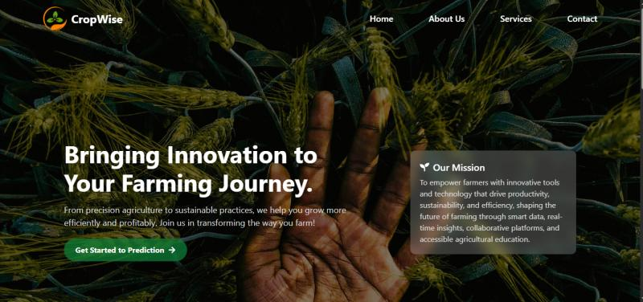
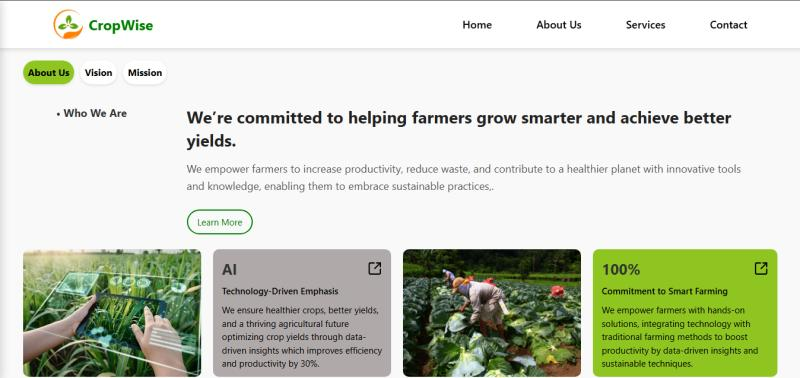
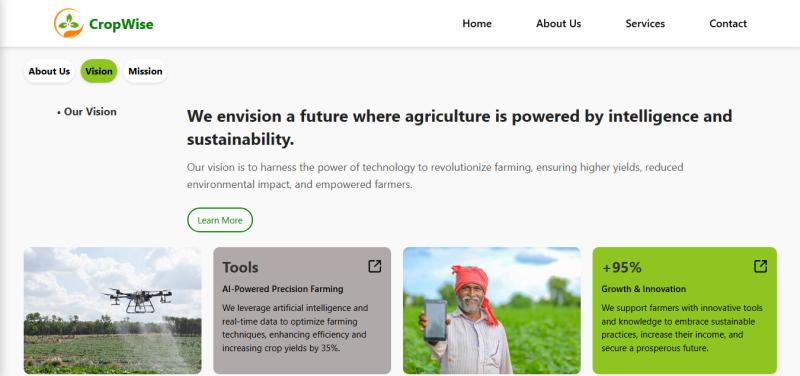
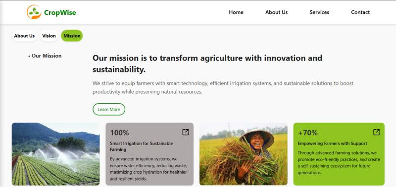
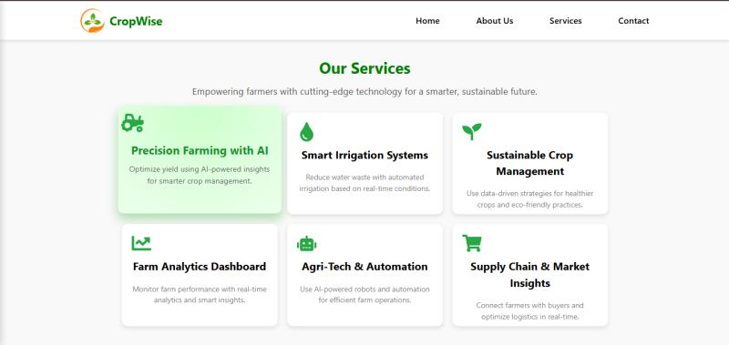
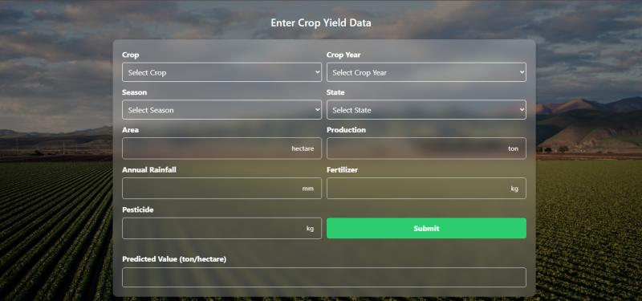
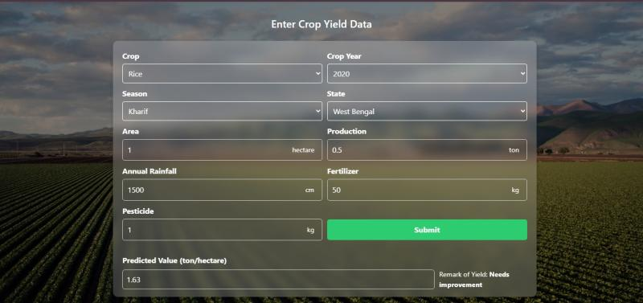
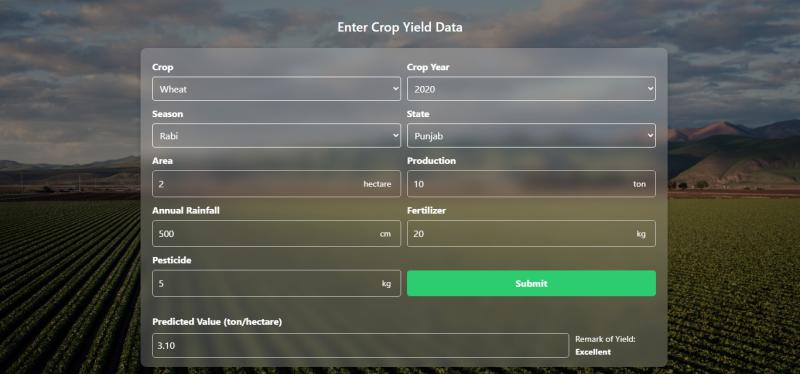

# Crop-Yield-Prediction

<h2>Description</h2>
Designed and developed a full-stack web application to predict agricultural crop yields based on user-input parameters such as crop type, season, geographical state, year, area, rainfall, fertilizer usage, and pesticide application.

<h2>Key Features</h2>

- Machine Learning Integration: Trained and deployed regression models using historical crop data to estimate yields (kg/ha) with crop-specific thresholds.
- Backend (Flask): Built a RESTful API using Flask to handle model inference, including preprocessing pipelines and label encoding via joblib.
- Frontend (React): Developed an interactive user interface allowing farmers and researchers to input data and instantly receive yield predictions.
- Data Sources: Utilized a curated dataset (crop_yield.csv) for model training and validation.
- Tools & Technologies: Python, Flask, Pandas, Scikit-learn, React, HTML/CSS, JavaScript, Joblib, Git.

<h2>Impact</h2>

- Aimed at supporting farmers and agricultural planners in making data-driven decisions to optimize crop production and resource allocation.
- Description: Designed and developed a full-stack web application to predict agricultural crop yields based on user-input parameters such as crop type, season, geographical state, year, area, rainfall, fertilizer usage, and pesticide application. 
- Key Features: Machine Learning Integration: Trained and deployed regression models using historical crop data to estimate yields (kg/ha) with crop-specific thresholds. 
- Backend (Flask): Built a RESTful API using Flask to handle model inference, including preprocessing pipelines and label encoding via joblib. 
- Frontend (React): Developed an interactive user interface allowing farmers and researchers to input data and instantly receive yield predictions. Data Sources: Utilized a curated dataset (crop_yield.csv) for model training and validation. 
- Tools & Technologies: Python, Flask, Pandas, Scikit-learn, React, HTML/CSS, JavaScript, Joblib, Git. 
- Impact: Aimed at supporting farmers and agricultural planners in making data-driven decisions to optimize crop production and resource allocation.

<h2>Skills</h2>

- Python (Pandas, NumPy, Scikit-learn, Matplotlib, Seaborn) 
- React.js 
- CSS3 
- Flask 
- Joblib 
- RESTful API 
- Front-End Development 
- Back-End Web Development 
- CORS 
- npm

<h2>Project Images</h2>

<h4>About Us</h4>

<h4>Mission</h4>

<h4>Vision</h4>

<h4>Services</h4>

<h4>Prediction Page</h4>

<h4>Rice Prediction : West Bengal</h4>

<h4>Wheat Prediction: Punjab</h4>

<h4>Barley Prediction: Himachal Pradesh</h4>

